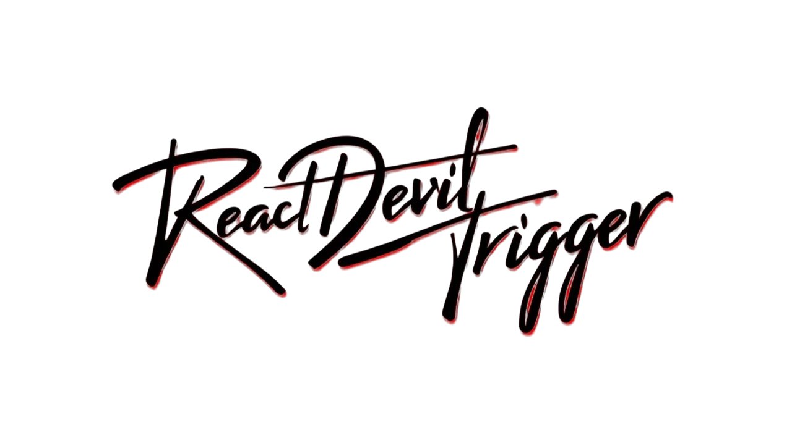
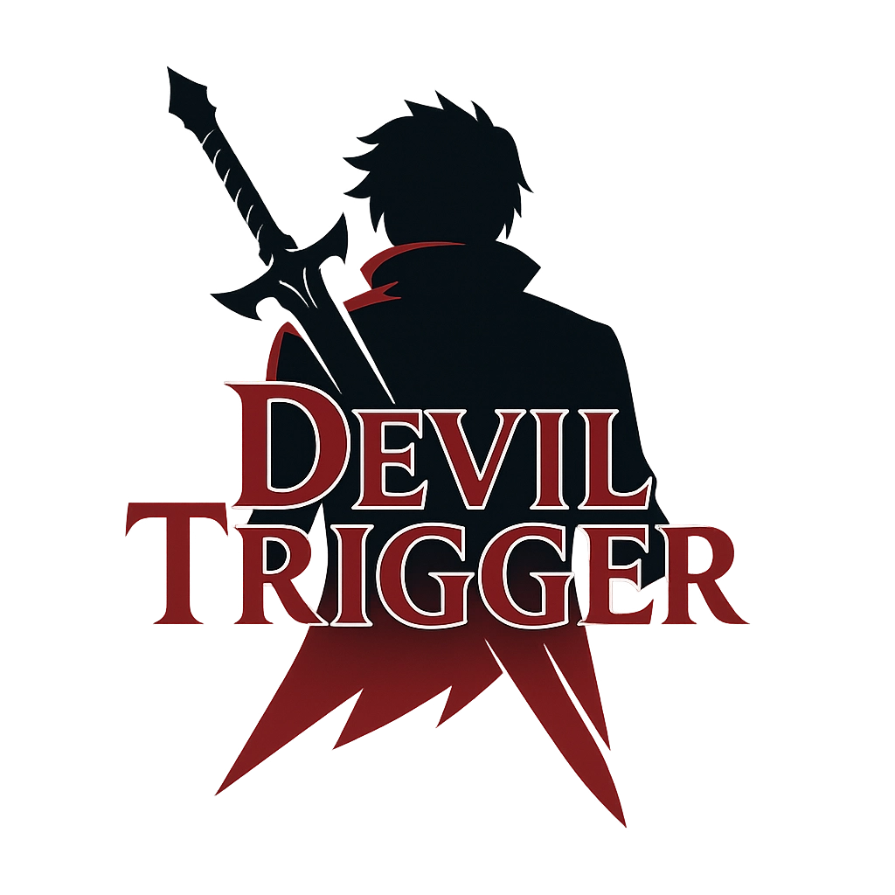

# React Devil Trigger

<p align="center">
  
</p>

[](https://www.npmjs.com/package/react-devil-trigger)
[](https://www.npmjs.com/package/react-devil-trigger)
[](https://github.com/tu-usuario/react-devil-trigger/blob/main/LICENSE)
[](https://bundlephobia.com/package/react-devil-trigger)

A stylish collection of React components with dynamic features and special effects, inspired by the fast-paced action of Devil May Cry.

## 🆕 What's New in v0.4.0

- **Size Variants**: Choose from 4 different sizes (sm, md, lg, xl) to fit your design
- **Center Positioning**: New position options for top-center and bottom-center
- **Enhanced Contrast**: Improved contrast across all character themes for better accessibility
- **Advanced Positioning**: Better handling of minimized state in all positions

## Installation

```bash
npm install react-devil-trigger
```

## Basic Usage Example

```jsx
import { AudioDevilTrigger } from 'react-devil-trigger';

function App() {
  return (
    <div>
      <AudioDevilTrigger
        audioSrc='path-to-audio.mp3'
        triggerWord='jackpot'
        characterTheme='dante'
      />
    </div>
  );
}
```

## Character Themes

Choose from various Devil May Cry character themes:

```jsx
<AudioDevilTrigger
  audioSrc="devils-never-cry.mp3"
  characterTheme="dante"
/>

<AudioDevilTrigger
  audioSrc="bury-the-light.mp3"
  characterTheme="vergil"
/>

<AudioDevilTrigger
  audioSrc="devil-trigger.mp3"
  characterTheme="nero"
/>
```

Available themes: `dante`, `vergil`, `nero`, `v`, `trish`, `lady`, `nico`, `sparda`, `default`

## Positioning Options

Choose where the player appears on the screen:

```jsx
<AudioDevilTrigger
  position="bottom-right" // Default position
/>

<AudioDevilTrigger
  position="top-center" // Centered at the top
/>

<AudioDevilTrigger
  position="bottom-center" // Centered at the bottom
/>
```

Available positions: `bottom-right`, `bottom-left`, `top-right`, `top-left`, `bottom-center`, `top-center`

## Size Variants

Choose the size that fits your design:

```jsx
<AudioDevilTrigger
  size="sm" // Small size
/>

<AudioDevilTrigger
  size="lg" // Large size
/>
```

Available sizes: `sm`, `md` (default), `lg`, `xl`

## Customizing Background

When customizing the background, there are two ways to set opacity:

1. **Using `backgroundColor` with opacity included**:

   ```jsx
   <AudioDevilTrigger
     backgroundColor='rgba(0, 0, 0, 0.7)'
     // backgroundOpacity is ignored when using rgba/hsla format
   />
   ```

2. **Using `backgroundColor` with `backgroundOpacity`**:
```jsx
<AudioDevilTrigger
     backgroundColor='#000000' // or any color name or hex code
     backgroundOpacity={0.7} // This will be applied to the color
/>
```

You can also adjust the backdrop blur effect:

```jsx
<AudioDevilTrigger
  backdropBlur={5} // Custom blur value in pixels
  // or
  backdropBlur={false} // Disable blur
/>
```

## Color Customization

Each theme comes with predefined colors, but you can override them:

```jsx
<AudioDevilTrigger
  characterTheme='vergil'
  primaryColor='#0055aa' // Override primary color
  secondaryColor='#ffffff' // Override secondary color
  accentColor='#00ffee' // Override accent color
/>
```

## Documentation

- [CHANGELOG](./CHANGELOG.md) - History of changes (English)
- [CHANGELOG en Español](./CHANGELOG.es.md) - Historial de cambios (Español)

## Developers

| Author | GitHub | 
|--------|--------|
| Adan-Perez | [Adan-Perez](https://github.com/Adan-Perez) |

## License

ISC License - see [LICENSE](LICENSE) for details

<p align="left">
  
</p>
